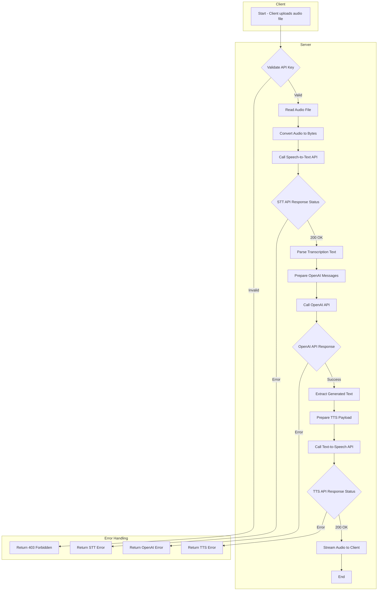

# Voice-To-Voice
`voice_to_voice` endpoint using a detailed Mermaid flowchart in a top-to-bottom (TB) diagram. This will illustrate all the branching and looping involved, helping you understand the state machine level of how this REST API server works.

### Mermaid Diagram:

### Explanation:

Let's break down each step in the diagram:

1. **Start - Client uploads audio file** (`A`):
   - The client sends a POST request to the `/voice-to-voice/` endpoint with an audio file.

2. **Validate API Key** (`B`):
   - The server checks the `x-api-key` header to ensure it's valid.
   - **Branching**:
     - **Valid**: Proceeds to read the audio file (`C`).
     - **Invalid**: Returns a `403 Forbidden` error (`Z`) to the client.

3. **Read Audio File** (`C`):
   - The server reads the uploaded audio file from the request.

4. **Convert Audio to Bytes** (`D`):
   - The audio file is read into bytes for processing.

5. **Call Speech-to-Text API** (`E`):
   - The server sends the audio bytes to the Microsoft Speech-to-Text API.

6. **STT API Response Status** (`F`):
   - **Branching**:
     - **200 OK**: The API successfully transcribes the audio and proceeds to parse the transcription text (`G`).
     - **Error**: Logs the error and returns an STT error (`Y`) to the client.

7. **Parse Transcription Text** (`G`):
   - The server extracts the transcribed text from the STT API response.

8. **Prepare OpenAI Messages** (`H`):
   - The server prepares the message payload for the OpenAI API, including the transcribed text.

9. **Call OpenAI API** (`I`):
   - The server sends the messages to the OpenAI GPT-4o model to generate a response.

10. **OpenAI API Response** (`J`):
    - **Branching**:
      - **Success**: The API returns a generated text response and proceeds to extract the generated text (`K`).
      - **Error**: Logs the error and returns an OpenAI error (`X`) to the client.

11. **Extract Generated Text** (`K`):
    - The server extracts the generated text from the OpenAI API response.

12. **Prepare TTS Payload** (`L`):
    - The server prepares the payload for the Eleven Labs Text-to-Speech API, including the generated text.

13. **Call Text-to-Speech API** (`M`):
    - The server sends the payload to the TTS API to synthesize speech.

14. **TTS API Response Status** (`N`):
    - **Branching**:
      - **200 OK**: The API successfully generates the audio and proceeds to stream the audio back to the client (`O`).
      - **Error**: Logs the error and returns a TTS error (`W`) to the client.

15. **Stream Audio to Client** (`O`):
    - The server streams the synthesized audio back to the client as a streaming response.

16. **End** (`P`):
    - The process completes successfully.

### Branching and Looping:

- **Branching** occurs at multiple decision points:
  - **API Key Validation**: Determines whether to proceed or return a `403 Forbidden`.
  - **API Response Checks**: After each external API call (STT, OpenAI, TTS), the server checks the response status and branches accordingly (success or error).

- **Looping** is implicit in the server's ability to handle multiple requests, but within a single request flow, there is no explicit looping unless you implement retries for failed API calls.

### State Machine Perspective:

- **States**:
  - **Idle**: Waiting for client requests.
  - **Validating API Key**.
  - **Processing STT**.
  - **Processing OpenAI Generation**.
  - **Processing TTS**.
  - **Streaming Response**.
  - **Error Handling**.

- **Transitions**:
  - **Success Paths**: Transition from one processing state to the next upon successful completion.
  - **Error Paths**: Transition to error handling state upon encountering errors.

### Detailed Steps with Error Handling:

1. **API Key Validation**:
   - If the API key is invalid, return `403 Forbidden`.
   - If valid, proceed to read the audio file.

2. **Speech-to-Text Conversion**:
   - Send audio bytes to the STT API.
   - **Error Handling**:
     - If the STT API returns an error, log it and return an error response.
     - If successful, parse the transcription text.

3. **OpenAI Text Generation**:
   - Prepare messages and send to OpenAI API.
   - **Error Handling**:
     - If the OpenAI API returns an error, log it and return an error response.
     - If successful, extract the generated text.

4. **Text-to-Speech Conversion**:
   - Prepare payload and send to TTS API.
   - **Error Handling**:
     - If the TTS API returns an error, log it and return an error response.
     - If successful, proceed to stream audio.

5. **Streaming Response**:
   - Stream the synthesized audio back to the client.
   - **End of Process**.

### Error Handling Nodes:

- **Z[Return 403 Forbidden]**:
  - Occurs when the API key is invalid or missing.

- **Y[Return STT Error]**:
  - Occurs when the Speech-to-Text API call fails.

- **X[Return OpenAI Error]**:
  - Occurs when the OpenAI API call fails.

- **W[Return TTS Error]**:
  - Occurs when the Text-to-Speech API call fails.

### Key Points:

- **Asynchronous Operations**:
  - The use of `async def` allows for non-blocking I/O operations, improving performance and scalability.

- **Dependency Injection**:
  - The `require_api_key` function is used as a dependency for API key validation.

- **Streaming Responses**:
  - The `StreamingResponse` is used to stream audio data back to the client efficiently.

- **Logging and Error Handling**:
  - Errors are logged at each step to aid in debugging.
  - Clients receive appropriate HTTP error responses with status codes and messages.
---
